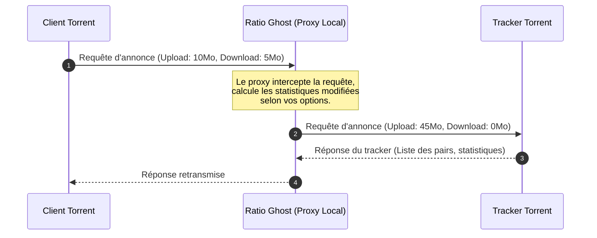

# 👻 Ratio Ghost

[](http://tcl.tk/)
[](license.txt)
[](#)

Traductions : [🇬🇧 English](readme.md) | [🇫🇷 Français](README.fr.md)

Ratio Ghost est un proxy local léger d'interception HTTP/HTTPS conçu pour modifier et améliorer automatiquement le ratio BitTorrent que vous rapportez aux trackers privés.

Écrit en Tcl/Tk, il agit comme un proxy "man-in-the-middle" entre votre client BitTorrent (ex: uTorrent, qBittorrent) et le tracker, ajustant vos statistiques d'upload et de download à la volée de manière transparente.

---

## ✨ Fonctionnalités clés

- **Manipulation intelligente du ratio** :
  - Calcule dynamiquement l'upload rapporté en fonction de multiplicateurs configurables.
  - Multiplicateurs d'upload personnalisés selon le nombre de peers (évite d'être banni sur les torrents ayant peu de leechers).
  - Ajout de boosts de vitesse artificiels (ex: pics aléatoires de 0 à $X$ Ko/s avec une probabilité configurable).
- **Options de discrétion (Stealth)** :
  - **Mode FreeLeech** : Rapporte le download à zéro tout en accumulant vos crédits d'upload.
  - **Prétendre être Seed (Pretend to Seed)** : Rapporte un statut de téléchargement terminé (zéro octet restant) pour apparaître immédiatement comme seeder.
- **Sécurité et portée** :
  - Limite les connexions à localhost (`127.0.0.1`) uniquement pour empêcher les accès externes.
  - Intercepte uniquement le trafic vers les trackers (ignore les requêtes web HTTP/HTTPS classiques).
- **Multiplateforme et portable** :
  - Fonctionne sous Windows, Linux et macOS.
  - Peut être compilé sous forme d'exécutable `.exe` unique et autonome sous Windows (sans dépendance).

---

## 🛠️ Démarrage rapide

### 1. Version exécutable (Windows)
Pour lancer Ratio Ghost sans aucune installation ou compilation :

1. Allez sur la page des [Releases](https://github.com/Mac-Cipher/RatioGhost/releases).
2. Téléchargez le fichier **`ratioghost.exe`** de la dernière version.
3. Double-cliquez sur le fichier téléchargé pour lancer l'application.

> [!NOTE]
> Si Windows Defender ou votre navigateur affiche un avertissement de sécurité (SmartScreen), c'est parce que l'exécutable autonome n'est pas signé numériquement. Vous pouvez cliquer sans crainte sur **"Informations complémentaires"** puis sur **"Exécuter quand même"**.

### 2. Lancer depuis le code source
Pour exécuter Ratio Ghost à partir du code source, vous devez avoir [Tcl/Tk](http://tcl.tk/) en version **8.6** installé.

Ouvrez un terminal dans le répertoire du projet et exécutez :
```bash
wish rghost.vfs/main.tcl
```

---

## ⚙️ Configuration du client Torrent

Pour rediriger les requêtes de vos trackers torrents vers Ratio Ghost :

1. Lancez **Ratio Ghost**. Il écoutera en local sur :
   - **Port HTTP** : `3773`
   - **Port HTTPS** : `3774`
2. Ouvrez les paramètres/préférences de votre client Torrent.
3. Allez dans la section **Connexion** ou **Serveur Proxy**.
4. Définissez le type de proxy sur **HTTP** (ou HTTPS).
5. Configurez l'adresse de l'hôte sur `127.0.0.1` et le port sur `3773`.
6. Activez l'option : *"Utiliser le proxy pour la résolution des noms d'hôtes"* (ou *"Utiliser le proxy pour les connexions de pair à pair"* si votre tracker l'exige, bien que Ratio Ghost soit conçu pour intercepter les requêtes du tracker, et non les connexions entre pairs).

#### 🔹 Détails de configuration pour qBittorrent
1. Ouvrez qBittorrent et allez dans **Outils** -> **Options** (or appuyez sur `Alt + O`).
2. Cliquez sur l'onglet **Connexion** dans le panneau de gauche.
3. Descendez jusqu'à la section **Serveur Proxy** :
   - **Type** : Sélectionnez HTTP.
   - **Hôte/Adresse** : Saisissez 127.0.0.1.
   - **Port** : Saisissez 3773 (ou 3774 si vous utilisez des annonces de trackers en HTTPS).
4. Assurez-vous que les options suivantes sont configurées :
   - **Utiliser le proxy pour les connexions aux pairs** : ❌ *Laisser décoché* (Ratio Ghost n'est pas un proxy pour les pairs, y acheminer le trafic des pairs ferait échouer les téléchargements).
   - **Utiliser le proxy pour les transferts vers les trackers** : Coché ! (Requis pour acheminer les requêtes des trackers via le proxy).
   - **Résoudre les noms d'hôtes par le proxy** : Coché.
5. Cliquez sur **Appliquer** puis sur **OK**.

#### 🔹 Détails de configuration pour uTorrent / BitTorrent
1. Ouvrez uTorrent et allez dans **Options** -> **Préférences** (ou appuyez sur `Ctrl + P`).
2. Cliquez sur l'onglet **Connexion** dans le panneau de gauche.
3. Localisez la section **Serveur Proxy** :
   - **Type** : Sélectionnez HTTP.
   - **Proxy** : Saisissez 127.0.0.1.
   - **Port** : Saisissez 3773.
4. Assurez-vous que les options suivantes sont configurées :
   - **Utiliser le proxy pour les connexions de pair à pair** : ❌ *Laisser décoché*.
   - **Résoudre les noms d'hôtes par le proxy** : Coché.
   - **Utiliser le proxy pour les communications avec le tracker** : Coché.
5. Cliquez sur **Appliquer** puis sur **OK**.

> [!IMPORTANT]
> Ratio Ghost n'intercepte que les **requêtes d'annonces des trackers**. Il ne redirige pas et ne masque pas votre trafic réel d'upload/download de pair à pair (P2P). Votre adresse IP restera donc visible pour les autres membres du swarm (l'essaim).

---

## 📖 Instructions d'utilisation

Une fois que Ratio Ghost est lancé et que votre client torrent est configuré pour l'utiliser, vous pouvez personnaliser la modification de votre ratio :

### 1. Interface générale
- **Onglet Log** : Affiche l'activité d'interception et de modification en temps réel. Double-cliquez sur n'importe quelle ligne de log pour afficher les détails de la connexion et les valeurs interceptées exactes.
- **Onglet Options** : C'est ici que vous configurez le comportement du moteur de modification de ratio.

### 2. Paramètres de modification (Onglet Options)
- **Rapporter le téléchargement à zéro (Report download as zero)** : (Fortement recommandé) Gèle vos statistiques de téléchargement rapportées à 0.
- **Prétendre être Seed (Pretend to seed)** : Vous déclare immédiatement comme seeder en rapportant 0 octet restant.
- **Vérification des Leechers (Leechers Check)** : Détermine le seuil minimum de leechers (par défaut 5). Si un torrent a moins de leechers que ce seuil, Ratio Ghost rapporte les vraies statistiques pour éviter d'éveiller les soupçons.
- **Multiplicateurs (Multipliers)** : Configure la plage de multiplicateurs aléatoires pour l'upload/download (ex : de 4.0 à 8.0 fois) qui sera appliquée à votre upload rapporté.
- **Boost d'upload (Upload Boost)** : Ajoute un boost de vitesse aléatoire (ex : jusqu'à 15 Ko/s avec une probabilité de 5%) pour simuler une activité réelle.

### 3. Exécution en arrière-plan
- **Fichier -> Cacher (File -> Hide)** : Réduit l'application dans la zone de notification Windows (Systray).
- **Fichier -> Quitter (File -> Exit)** : Ferme complètement l'application. Vous pouvez également faire un clic droit sur l'icône dans la zone de notification et choisir **Exit**.

---

## 🚀 Comment ça marche



---

## 📦 Compilation et packaging (Autonome en .EXE)

Si vous avez modifié le code source dans `rghost.vfs/` et souhaitez compiler un nouvel exécutable autonome pour Windows :

### Prérequis
Assurez-vous que les fichiers suivants sont présents à la racine du projet :
- [tclkit.exe](file:///c:/Users/LUCAS/Documents/WORKSPACE/1%20PROJECTS/Vibe%20Coding/RatioGhost/tclkit.exe) (runtime Tcl/Tk 32 bits pour assurer la compatibilité avec les bibliothèques natives comme `Winico`)
- [tclkitsh.exe](file:///c:/Users/LUCAS/Documents/WORKSPACE/1%20PROJECTS/Vibe%20Coding/RatioGhost/tclkitsh.exe) (runtime console 32 bits)
- [sdx.kit](file:///c:/Users/LUCAS/Documents/WORKSPACE/1%20PROJECTS/Vibe%20Coding/RatioGhost/sdx.kit) (utilitaire Starkit Developer Extension)

### Commande de compilation
Exécutez la commande PowerShell suivante à la racine du projet :

```powershell
.\tclkitsh.exe sdx.kit wrap ratioghost.exe -runtime .\tclkit.exe -vfs rghost.vfs
```

> [!TIP]
> **Pourquoi du 32 bits ?**
> L'application utilise le package `Winico` pour s'intégrer à la zone de notification Windows. Celui-ci utilise une DLL native 32 bits (`Winico06.dll`). L'utilisation d'un runtime 32 bits évite les plantages liés aux architectures incompatibles au démarrage.

---

## 📂 Architecture du projet

- [rghost.vfs/](file:///c:/Users/LUCAS/Documents/WORKSPACE/1%20PROJECTS/Vibe%20Coding/RatioGhost/rghost.vfs) : Le système de fichiers virtuel (Virtual File System) contenant le code et les ressources.
  - [rghost.vfs/main.tcl](file:///c:/Users/LUCAS/Documents/WORKSPACE/1%20PROJECTS/Vibe%20Coding/RatioGhost/rghost.vfs/main.tcl) : Script de point d'entrée principal.
  - [rghost.vfs/lib/app-ghost/ghost.tcl](file:///c:/Users/LUCAS/Documents/WORKSPACE/1%20PROJECTS/Vibe%20Coding/RatioGhost/rghost.vfs/lib/app-ghost/ghost.tcl) : Initialisation, gestionnaire de configuration et planificateur.
  - [rghost.vfs/lib/app-ghost/proxy.tcl](file:///c:/Users/LUCAS/Documents/WORKSPACE/1%20PROJECTS/Vibe%20Coding/RatioGhost/rghost.vfs/lib/app-ghost/proxy.tcl) : Moteur principal du proxy d'interception HTTP/HTTPS.
  - [rghost.vfs/lib/app-ghost/gui.tcl](file:///c:/Users/LUCAS/Documents/WORKSPACE/1%20PROJECTS/Vibe%20Coding/RatioGhost/rghost.vfs/lib/app-ghost/gui.tcl) : Interface utilisateur basée sur Tk.
  - [rghost.vfs/lib/app-ghost/util.tcl](file:///c:/Users/LUCAS/Documents/WORKSPACE/1%20PROJECTS/Vibe%20Coding/RatioGhost/rghost.vfs/lib/app-ghost/util.tcl) : Utilitaires et fonctions de formatage.
  - [rghost.vfs/lib/app-ghost/update.tcl](file:///c:/Users/LUCAS/Documents/WORKSPACE/1%20PROJECTS/Vibe%20Coding/RatioGhost/rghost.vfs/lib/app-ghost/update.tcl) : Gestionnaire de vérification des mises à jour logicielles.

---

## 📝 Licence

Distribué sous la licence GNU General Public License v3. Voir le fichier [license.txt](file:///c:/Users/LUCAS/Documents/WORKSPACE/1%20PROJECTS/Vibe%20Coding/RatioGhost/license.txt) pour plus de détails.
