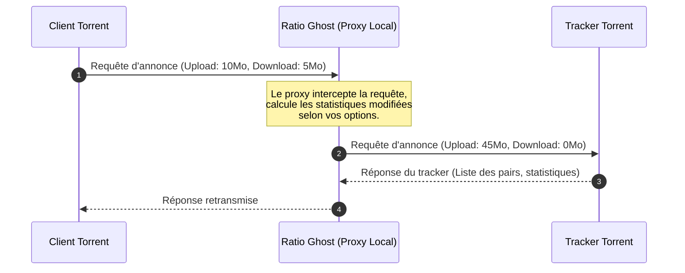

# 👻 Ratio Ghost

[](http://tcl.tk/)
[](license.txt)
[](#)

Traductions : [🇬🇧 English](readme.md) | [🇫🇷 Français](README.fr.md)

Ratio Ghost est un proxy local léger d'interception HTTP/HTTPS conçu pour modifier et améliorer automatiquement le ratio BitTorrent que vous rapportez aux trackers privés.

Écrit en Tcl/Tk, il agit comme un proxy "man-in-the-middle" entre votre client BitTorrent (ex: uTorrent, qBittorrent) et le tracker, ajustant vos statistiques d'upload et de download à la volée de manière transparente.

> [!NOTE]
> Une migration progressive C#/.NET 10 + Avalonia est maintenant développée côte à côte avec la version Tcl. Le jalon Windows inclut le proxy HTTP/HTTPS, une CA locale propre à l'installation avec consentement explicite, le tray, la persistance et un package autonome `win-x64`. Les tests isolés d'annonces HTTP et HTTPS avec le vrai qBittorrent, une première comparaison à entrée identique avec Tcl et le cycle de confiance Windows dans `CurrentUser\Root` (1/1) passent sous Windows. Le consentement depuis l'UI packagée, la validation qBittorrent avec la racine approuvée et les intégrations desktop complètes macOS/Linux restent à terminer ; les services d'autostart Linux XDG et macOS LaunchAgent sont toutefois couverts par des tests de fichiers isolés. Consultez [`docs/MIGRATION.md`](docs/MIGRATION.md).

---

## ✨ Fonctionnalités clés

- **Manipulation intelligente du ratio** :
  - Calcule dynamiquement l'upload rapporté en fonction de multiplicateurs configurables.
  - Multiplicateurs d'upload personnalisés selon le nombre de peers (évite d'être banni sur les torrents ayant peu de leechers).
  - Ajout de boosts de vitesse artificiels (ex: pics aléatoires de 0 à $X$ Ko/s avec une probabilité configurable).
- **Options de discrétion (Stealth)** :
  - **Mode FreeLeech** : Rapporte le download à zéro tout en accumulant vos crédits d'upload.
  - **Prétendre être Seed (Pretend to Seed)** : Rapporte un statut de téléchargement terminé (zéro octet restant) pour apparaître immédiatement comme seeder.
- **Sécurité et portée** :
  - Limite les connexions à localhost (`127.0.0.1`) uniquement pour empêcher les accès externes.
  - Intercepte uniquement le trafic vers les trackers (ignore les requêtes web HTTP/HTTPS classiques).
- **Windows et portable** :
  - Testé et distribué pour Windows.
  - Produit un exécutable `.exe` unique avec son magasin d'autorités TLS inclus.

---

## 🛠️ Téléchargement et Installation

### 1. Version exécutable (Windows)
Pour lancer Ratio Ghost sans aucune installation ou compilation :

1. Allez sur la page des [Releases](https://github.com/Mac-Cipher/RatioGhost/releases).
2. Téléchargez le fichier **`ratioghost.exe`** de la dernière version.
3. Téléchargez `ratioghost.exe.sha256` et vérifiez l'exécutable avant de le lancer :
   ```powershell
   Get-FileHash .\ratioghost.exe -Algorithm SHA256
   Get-Content .\ratioghost.exe.sha256
   ```
4. Double-cliquez sur l'exécutable vérifié pour lancer l'application.

> [!NOTE]
> Si SmartScreen signale l'exécutable non signé, ne le lancez qu'après avoir vérifié que son SHA-256 correspond au checksum publié avec la release GitHub.

### Aperçu du jalon .NET Windows

Les releases taguées conservent l'exécutable Tcl ci-dessus et publient séparément `RatioGhost-dotnet-win-x64.zip` avec `RatioGhost-dotnet-win-x64.zip.sha256`. Vérifiez le checksum, décompressez l'archive, puis lancez `RatioGhost.exe`. L'activation HTTPS demande une confirmation explicite dans l'onglet **Platform**, suivie du dialogue de sécurité Windows. Ce package est le jalon de migration Windows ; consultez [`docs/MIGRATION.md`](docs/MIGRATION.md) avant de remplacer votre utilisation Tcl.

### 2. Lancer depuis le code source
L'environnement d'exécution officiellement supporté reste Windows. La CI compile le projet Avalonia et exécute les tests .NET communs ainsi que la frontière des services de plateforme sous Windows, Linux et macOS ; Ubuntu WSL exerce aussi le service d'autostart XDG Linux et le service macOS LaunchAgent est testé avec un chemin injecté, mais l'application desktop complète, les magasins de certificats Linux/macOS et les intégrations natives tray/session ne sont pas encore validés. La version Tcl/Tk exige Windows, Tcl/Tk 8.6 et les bibliothèques natives incluses dans ce dépôt.

Ouvrez un terminal dans le répertoire du projet et exécutez :
```bash
wish rghost.vfs/main.tcl
```

---

## ⚙️ Configuration du client Torrent

Pour rediriger les requêtes de vos trackers torrents vers Ratio Ghost :

1. Lancez **Ratio Ghost**. Il écoutera en local sur :
   - **Port HTTP** : `3773`
   - **Port HTTPS** : `3774`
2. Ouvrez les paramètres/préférences de votre client Torrent.
3. Allez dans la section **Connexion** ou **Serveur Proxy**.
4. Définissez le type de proxy sur **HTTP**.
5. Configurez l'adresse de l'hôte sur `127.0.0.1` et le port sur `3773`.
6. Activez l'option : *"Utiliser le proxy pour la résolution des noms d'hôtes"* (ou *"Utiliser le proxy pour les connexions de pair à pair"* si votre tracker l'exige, bien que Ratio Ghost soit conçu pour intercepter les requêtes du tracker, et non les connexions entre pairs).

#### 🔹 Détails de configuration pour qBittorrent
1. Ouvrez qBittorrent et allez dans **Outils** -> **Options** (or appuyez sur `Alt + O`).
2. Cliquez sur l'onglet **Connexion** dans le panneau de gauche.
3. Descendez jusqu'à la section **Serveur Proxy** :
   - **Type** : Sélectionnez HTTP.
   - **Hôte/Adresse** : Saisissez 127.0.0.1.
   - **Port** : Saisissez toujours `3773`, y compris pour les trackers HTTPS (`CONNECT` est intercepté localement afin d'ajuster les annonces du tracker).
4. Assurez-vous que les options suivantes sont configurées :
   - **Utiliser le proxy pour les connexions aux pairs** : ❌ *Laisser décoché* (Ratio Ghost n'est pas un proxy pour les pairs, y acheminer le trafic des pairs ferait échouer les téléchargements).
   - **Utiliser le proxy pour les transferts vers les trackers** : Coché ! (Requis pour acheminer les requêtes des trackers via le proxy).
   - **Résoudre les noms d'hôtes par le proxy** : Coché.
5. Cliquez sur **Appliquer** puis sur **OK**.

#### 🔹 Détails de configuration pour uTorrent / BitTorrent
1. Ouvrez uTorrent et allez dans **Options** -> **Préférences** (ou appuyez sur `Ctrl + P`).
2. Cliquez sur l'onglet **Connexion** dans le panneau de gauche.
3. Localisez la section **Serveur Proxy** :
   - **Type** : Sélectionnez HTTP.
   - **Proxy** : Saisissez 127.0.0.1.
   - **Port** : Saisissez 3773.
4. Assurez-vous que les options suivantes sont configurées :
   - **Utiliser le proxy pour les connexions de pair à pair** : ❌ *Laisser décoché*.
   - **Résoudre les noms d'hôtes par le proxy** : Coché.
   - **Utiliser le proxy pour les communications avec le tracker** : Coché.
5. Cliquez sur **Appliquer** puis sur **OK**.

> [!IMPORTANT]
> Ratio Ghost modifie les annonces des trackers HTTP et HTTPS. Le trafic HTTPS est déchiffré uniquement sur localhost, puis rechiffré vers le tracker avec validation de la chaîne CA et du nom d'hôte. Il ne redirige ni ne masque le trafic pair-à-pair : votre adresse IP reste visible aux autres membres de l'essaim.

> [!WARNING]
> L'exécutable Tcl historique utilise encore un certificat local autosigné unique. La nouvelle application .NET utilise au contraire une CA propre à l'installation et des certificats générés par hôte. Son cycle Windows de stockage Root assisté passe maintenant 1/1 et supprime exactement la CA ; le consentement depuis l'UI packagée et la validation qBittorrent avec la racine approuvée restent à valider dans un test d'interopérabilité dédié. Conservez Ratio Ghost sur localhost.

---

## 📖 Instructions d'utilisation

Une fois que Ratio Ghost est lancé et que votre client torrent est configuré pour l'utiliser, vous pouvez personnaliser la modification de votre ratio :

### 1. Interface générale
- **Onglet Log** : Affiche l'activité d'interception et de modification en temps réel. Double-cliquez sur n'importe quelle ligne de log pour afficher les détails de la connexion et les valeurs interceptées exactes.
- **Onglet Options** : C'est ici que vous configurez le comportement du moteur de modification de ratio.

### 2. Paramètres de modification (Onglet Options)
- **Rapporter le téléchargement à zéro (Report download as zero)** : (Fortement recommandé) Gèle vos statistiques de téléchargement rapportées à 0.
- **Prétendre être Seed (Pretend to seed)** : Vous déclare immédiatement comme seeder en rapportant 0 octet restant.
- **Vérification des Leechers (Leechers Check)** : Détermine le seuil minimum de leechers (par défaut 5). Si un torrent a moins de leechers que ce seuil, Ratio Ghost rapporte les vraies statistiques pour éviter d'éveiller les soupçons.
- **Multiplicateurs (Multipliers)** : Configure la plage de multiplicateurs aléatoires pour l'upload/download (ex : de 4.0 à 8.0 fois) qui sera appliquée à votre upload rapporté.
- **Boost d'upload (Upload Boost)** : Ajoute un boost de vitesse aléatoire (ex : jusqu'à 15 Ko/s avec une probabilité de 5%) pour simuler une activité réelle.
- **Journal de diagnostic redacted** : Activez, si nécessaire, un journal tournant dans le profil ; les identifiants des trackers et les segments assimilables à des jetons sont masqués.

### 3. Exécution en arrière-plan
- **Fichier -> Cacher (File -> Hide)** : Réduit l'application dans la zone de notification Windows (Systray).
- **Fichier -> Quitter (File -> Exit)** : Ferme complètement l'application. Vous pouvez également faire un clic droit sur l'icône dans la zone de notification et choisir **Exit**.

---

## 🚀 Comment ça marche



---

## 📦 Compilation et packaging (Autonome en .EXE)

Si vous avez modifié le code source dans `rghost.vfs/` et souhaitez compiler un nouvel exécutable autonome pour Windows :

### Prérequis
Assurez-vous que les fichiers suivants sont présents à la racine du projet :
- `tclkit.exe` (runtime Tcl/Tk 32 bits pour assurer la compatibilité avec les bibliothèques natives comme `Winico`)
- `tclkitsh.exe` (runtime console 32 bits)
- `sdx.kit` (utilitaire Starkit Developer Extension)

### Commande de compilation
Exécutez la commande PowerShell suivante à la racine du projet :

```powershell
.\tclkitsh.exe sdx.kit wrap ratioghost.exe -runtime .\tclkit.exe -vfs rghost.vfs
```

### Tests

Exécutez les tests Tcl automatisés avant de créer l'exécutable :

```powershell
.\tclkitsh.exe tests\all.tcl
```

Pour vérifier le package .NET Windows du jalon prioritaire, exécutez la séquence de publication et de smoke dans PowerShell :

```powershell
.\scripts\package-win-x64.ps1
.\scripts\smoke-win-x64.ps1
```

Ratio Ghost génère un certificat TLS local et une clé privée uniques dans le profil utilisateur pour intercepter les trackers HTTPS. La clé privée n'est jamais distribuée dans le dépôt ou l'exécutable. La journalisation persistante du proxy est désactivée par défaut ; lorsqu'elle est activée explicitement, le proxy .NET écrit un journal tournant après avoir masqué les identifiants des trackers et les segments de chemin assimilables à des jetons.

> [!TIP]
> **Pourquoi du 32 bits ?**
> L'application utilise le package `Winico` pour s'intégrer à la zone de notification Windows. Celui-ci utilise une DLL native 32 bits (`Winico06.dll`). L'utilisation d'un runtime 32 bits évite les plantages liés aux architectures incompatibles au démarrage.

---

## 📂 Architecture du projet

- `rghost.vfs/` : Le système de fichiers virtuel (Virtual File System) contenant le code et les ressources.
  - `rghost.vfs/main.tcl` : Script de point d'entrée principal.
  - `rghost.vfs/lib/app-ghost/ghost.tcl` : Initialisation, gestionnaire de configuration et planificateur.
  - `rghost.vfs/lib/app-ghost/proxy.tcl` : Moteur principal du proxy d'interception HTTP/HTTPS.
  - `rghost.vfs/lib/app-ghost/gui.tcl` : Interface utilisateur basée sur Tk.
  - `rghost.vfs/lib/app-ghost/util.tcl` : Utilitaires et fonctions de formatage.
  - `rghost.vfs/lib/app-ghost/update.tcl` : Gestionnaire de vérification des mises à jour logicielles.

---

## 📝 Licence

Distribué sous la licence GNU General Public License v3. Voir le fichier [`license.txt`](license.txt) pour plus de détails.

