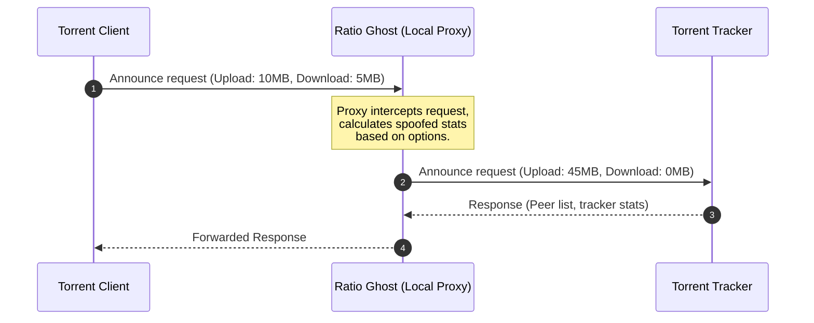

# 👻 Ratio Ghost

[](http://tcl.tk/)
[](license.txt)
[](#)

Translations: [🇬🇧 English](readme.md) | [🇫🇷 Français](README.fr.md)

Ratio Ghost is a lightweight, local HTTP/HTTPS intercepting proxy designed to automatically modify and improve your BitTorrent ratio reported to private trackers.

Written in Tcl/Tk, it acts as a man-in-the-middle proxy between your BitTorrent client (e.g., uTorrent, qBittorrent) and the tracker, seamlessly adjusting your upload and download statistics on the fly.

---

## ✨ Key Features

- **Smart Ratio Manipulation**:
  - Dynamically calculates reported upload based on configurable multipliers.
  - Custom upload multipliers for different peer count scenarios (avoids flags on low-leecher torrents).
  - Add artificial speed boosts (e.g., random spikes of 0 to $X$ KB/s with a configurable chance).
- **Stealth Options**:
  - **FreeLeech Mode**: Report download amounts as zero while still gaining upload credits.
  - **Pretend to Seed**: Mark download status as complete (zero bytes left) to appear as a seeder immediately.
- **Security & Scope**:
  - Limit connections to localhost (`127.0.0.1`) only to prevent external access.
  - Intercept only tracker traffic (ignores regular HTTP/HTTPS web requests).
- **Cross-Platform & Portable**:
  - Runs on Windows, Linux, and macOS.
  - Can be built into a single, zero-dependency `.exe` binary on Windows.

---

## 🛠️ Getting Started

### 1. Pre-built Executable (Windows)
To run Ratio Ghost without any installation or compilation:

1. Go to the [Releases](https://github.com/Mac-Cipher/RatioGhost/releases) page.
2. Download the **`ratioghost.exe`** file from the latest version.
3. Double-click the downloaded file to launch the application.

> [!NOTE]
> If Windows Defender or your web browser displays a security warning (SmartScreen), this is because the standalone executable is not digitally signed. You can safely bypass this by clicking **"More info"** and then **"Run anyway"**.

### 2. Running From Source
To run Ratio Ghost from the source code, you need [Tcl/Tk](http://tcl.tk/) version **8.6** installed.

Open a terminal in the project directory and run:
```bash
wish rghost.vfs/main.tcl
```

---

## ⚙️ Torrent Client Configuration

To route your torrent tracker announces through Ratio Ghost:

1. Launch **Ratio Ghost**. It will listen locally on:
   - **HTTP Port**: `3773`
   - **HTTPS Port**: `3774`
2. Open your torrent client settings/preferences.
3. Go to **Connection** or **Proxy Server** settings.
4. Set the Proxy type to **HTTP** (or HTTPS).
5. Set Host/Address to `127.0.0.1` and Port to `3773`.
6. Enable the option: *"Use proxy for hostname lookups"* (or *"Use proxy for peer-to-peer connections"* if your tracker requires it, although Ratio Ghost is designed to intercept tracker requests, not peer connections).

#### 🔹 qBittorrent Configuration Details
1. Open qBittorrent and go to **Tools** -> **Options** (or press `Alt + O`).
2. Click on the **Connection** tab in the left panel.
3. Scroll down to the **Proxy Server** section:
   - **Type**: Select HTTP.
   - **Host/Address**: Enter 127.0.0.1.
   - **Port**: Enter 3773 (or 3774 if using HTTPS tracker announces).
4. Ensure the following options are set:
   - **Use proxy for peer connections**: ❌ *Leave unchecked* (Ratio Ghost is not a peer proxy, routing peer data will fail).
   - **Use proxy for torrent transmission**: Check this! (Required to route tracker announces through the proxy).
   - **Perform hostname lookups via proxy**: Check this.
5. Click **Apply** and **OK**.

#### 🔹 uTorrent / BitTorrent Configuration Details
1. Open uTorrent and go to **Options** -> **Preferences** (or press `Ctrl + P`).
2. Click on the **Connection** tab in the left panel.
3. Locate the **Proxy Server** section:
   - **Type**: Select HTTP.
   - **Proxy**: Enter 127.0.0.1.
   - **Port**: Enter 3773.
4. Ensure the following options are set:
   - **Use proxy for peer-to-peer connections**: ❌ *Leave unchecked*.
   - **Resolve hostnames through proxy**: Check this.
   - **Use proxy for tracker communications**: Check this.
5. Click **Apply** and **OK**.

> [!IMPORTANT]
> Ratio Ghost only intercepts **tracker announces**. It does not route or hide your actual peer-to-peer torrent upload/download traffic. Your IP will still be visible to other peers in the swarm.

---

## 📖 Usage Instructions

Once Ratio Ghost is running and your torrent client is configured to route through it, you can customize how your ratio is modified:

### 1. General Interface
- **Log Tab**: Displays real-time spoofing activity. Double-click any log line to see detailed connection data and exact intercept values.
- **Options Tab**: Where you configure the ratio-spoofing engine behavior.

### 2. Spoofing Settings (Options Tab)
- **Report download as zero**: (Highly Recommended) Freezes your reported download amount at 0.
- **Pretend to seed**: Marks you as a seeder immediately by reporting 0 bytes left.
- **Leechers Check**: Set the minimum leechers threshold (default is 5). If a torrent has fewer leechers, it reports actual stats to avoid looking suspicious.
- **Multipliers**: Set the random multiplier range for both upload/download (e.g. 4.0 to 8.0 times) which will be added to your reported upload.
- **Upload Boost**: Add a random speed boost (e.g., up to 15 KB/s with a 5% chance) to simulate real activity.

### 3. Background Execution
- **File -> Hide**: Minimizes the application to the Windows System Tray (Systray).
- **File -> Exit**: Exits the application entirely. Alternatively, right-click the system tray icon and choose **Exit**.

---

## 🚀 How it Works



---

## 📦 Building & Packaging (Standalone EXE)

If you have modified the source code in `rghost.vfs/` and want to compile a new standalone Windows executable:

### Prerequisites
Make sure the following files are present in the root folder:
- [tclkit.exe](file:///c:/Users/LUCAS/Documents/WORKSPACE/1%20PROJECTS/Vibe%20Coding/RatioGhost/tclkit.exe) (32-bit Tcl/Tk runtime to ensure compatibility with native libraries like `Winico`)
- [tclkitsh.exe](file:///c:/Users/LUCAS/Documents/WORKSPACE/1%20PROJECTS/Vibe%20Coding/RatioGhost/tclkitsh.exe) (32-bit console runtime)
- [sdx.kit](file:///c:/Users/LUCAS/Documents/WORKSPACE/1%20PROJECTS/Vibe%20Coding/RatioGhost/sdx.kit) (Starkit Developer Extension utility)

### Compilation Command
Run the following PowerShell command in the project root:

```powershell
.\tclkitsh.exe sdx.kit wrap ratioghost.exe -runtime .\tclkit.exe -vfs rghost.vfs
```

> [!TIP]
> **Why 32-bit?**
> The application uses the `Winico` package for Windows system tray integration, which contains a native 32-bit DLL (`Winico06.dll`). Packaging using a 32-bit runtime avoids architecture mismatch crashes on startup.

---

## 📂 Project Architecture

- [rghost.vfs/](file:///c:/Users/LUCAS/Documents/WORKSPACE/1%20PROJECTS/Vibe%20Coding/RatioGhost/rghost.vfs): The Virtual File System containing code and assets.
  - [rghost.vfs/main.tcl](file:///c:/Users/LUCAS/Documents/WORKSPACE/1%20PROJECTS/Vibe%20Coding/RatioGhost/rghost.vfs/main.tcl): Entrypoint script.
  - [rghost.vfs/lib/app-ghost/ghost.tcl](file:///c:/Users/LUCAS/Documents/WORKSPACE/1%20PROJECTS/Vibe%20Coding/RatioGhost/rghost.vfs/lib/app-ghost/ghost.tcl): Startup, configuration manager, and scheduler.
  - [rghost.vfs/lib/app-ghost/proxy.tcl](file:///c:/Users/LUCAS/Documents/WORKSPACE/1%20PROJECTS/Vibe%20Coding/RatioGhost/rghost.vfs/lib/app-ghost/proxy.tcl): Main intercepting HTTP/HTTPS proxy engine.
  - [rghost.vfs/lib/app-ghost/gui.tcl](file:///c:/Users/LUCAS/Documents/WORKSPACE/1%20PROJECTS/Vibe%20Coding/RatioGhost/rghost.vfs/lib/app-ghost/gui.tcl): Tk-based user interface.
  - [rghost.vfs/lib/app-ghost/util.tcl](file:///c:/Users/LUCAS/Documents/WORKSPACE/1%20PROJECTS/Vibe%20Coding/RatioGhost/rghost.vfs/lib/app-ghost/util.tcl): Helper utilities and formatting functions.
  - [rghost.vfs/lib/app-ghost/update.tcl](file:///c:/Users/LUCAS/Documents/WORKSPACE/1%20PROJECTS/Vibe%20Coding/RatioGhost/rghost.vfs/lib/app-ghost/update.tcl): Software update checker.

---

## 📝 License

Distributed under the GNU General Public License v3. See [license.txt](file:///c:/Users/LUCAS/Documents/WORKSPACE/1%20PROJECTS/Vibe%20Coding/RatioGhost/license.txt) for more details.

