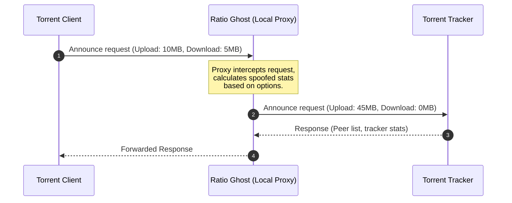

# 👻 Ratio Ghost

[](http://tcl.tk/)
[](license.txt)
[](#)

Ratio Ghost is a lightweight, local HTTP/HTTPS intercepting proxy designed to automatically modify and improve your BitTorrent ratio reported to private trackers.

Written in Tcl/Tk, it acts as a man-in-the-middle proxy between your BitTorrent client (e.g., uTorrent, qBittorrent) and the tracker, seamlessly adjusting your upload and download statistics on the fly.

---

## ✨ Key Features

- **Smart Ratio Manipulation**:
  - Dynamically calculates reported upload based on configurable multipliers.
  - Custom upload multipliers for different peer count scenarios (avoids flags on low-leecher torrents).
  - Add artificial speed boosts (e.g., random spikes of 0 to $X$ KB/s with a configurable chance).
- **Stealth Options**:
  - **FreeLeech Mode**: Report download amounts as zero while still gaining upload credits.
  - **Pretend to Seed**: Mark download status as complete (zero bytes left) to appear as a seeder immediately.
- **Security & Scope**:
  - Limit connections to localhost (`127.0.0.1`) only to prevent external access.
  - Intercept only tracker traffic (ignores regular HTTP/HTTPS web requests).
- **Cross-Platform & Portable**:
  - Runs on Windows, Linux, and macOS.
  - Can be built into a single, zero-dependency `.exe` binary on Windows.

---

## 🚀 How it Works



---

## 🛠️ Getting Started

### 1. Pre-built Executable (Windows)
Simply run the standalone [ratioghost.exe](file:///c:/Users/LUCAS/Documents/WORKSPACE/1%20PROJECTS/Vibe%20Coding/RatioGhost/ratioghost.exe) binary. 
It requires no installation and runs completely out-of-the-box.

### 2. Running From Source
To run Ratio Ghost from the source code, you need [Tcl/Tk](http://tcl.tk/) version **8.6** installed.

Open a terminal in the project directory and run:
```bash
wish rghost.vfs/main.tcl
```

---

## 📦 Building & Packaging (Standalone EXE)

If you have modified the source code in `rghost.vfs/` and want to compile a new standalone Windows executable:

### Prerequisites
Make sure the following files are present in the root folder:
- [tclkit.exe](file:///c:/Users/LUCAS/Documents/WORKSPACE/1%20PROJECTS/Vibe%20Coding/RatioGhost/tclkit.exe) (32-bit Tcl/Tk runtime to ensure compatibility with native libraries like `Winico`)
- [tclkitsh.exe](file:///c:/Users/LUCAS/Documents/WORKSPACE/1%20PROJECTS/Vibe%20Coding/RatioGhost/tclkitsh.exe) (32-bit console runtime)
- [sdx.kit](file:///c:/Users/LUCAS/Documents/WORKSPACE/1%20PROJECTS/Vibe%20Coding/RatioGhost/sdx.kit) (Starkit Developer Extension utility)

### Compilation Command
Run the following PowerShell command in the project root:

```powershell
.\tclkitsh.exe sdx.kit wrap ratioghost.exe -runtime .\tclkit.exe -vfs rghost.vfs
```

> [!TIP]
> **Why 32-bit?**
> The application uses the `Winico` package for Windows system tray integration, which contains a native 32-bit DLL (`Winico06.dll`). Packaging using a 32-bit runtime avoids architecture mismatch crashes on startup.

---

## ⚙️ Torrent Client Configuration

To route your torrent tracker announces through Ratio Ghost:

1. Launch **Ratio Ghost**. It will listen locally on:
   - **HTTP Port**: `3773`
   - **HTTPS Port**: `3774`
2. Open your torrent client settings/preferences.
3. Go to **Connection** or **Proxy Server** settings.
4. Set the Proxy type to **HTTP** (or HTTPS).
5. Set Host/Address to `127.0.0.1` and Port to `3773`.
6. Enable the option: *"Use proxy for hostname lookups"* (or *"Use proxy for peer-to-peer connections"* if your tracker requires it, although Ratio Ghost is designed to intercept tracker requests, not peer connections).

> [!IMPORTANT]
> Ratio Ghost only intercepts **tracker announces**. It does not route or hide your actual peer-to-peer torrent upload/download traffic. Your IP will still be visible to other peers in the swarm.

---

## 📂 Project Architecture

- [rghost.vfs/](file:///c:/Users/LUCAS/Documents/WORKSPACE/1%20PROJECTS/Vibe%20Coding/RatioGhost/rghost.vfs): The Virtual File System containing code and assets.
  - [rghost.vfs/main.tcl](file:///c:/Users/LUCAS/Documents/WORKSPACE/1%20PROJECTS/Vibe%20Coding/RatioGhost/rghost.vfs/main.tcl): Entrypoint script.
  - [rghost.vfs/lib/app-ghost/ghost.tcl](file:///c:/Users/LUCAS/Documents/WORKSPACE/1%20PROJECTS/Vibe%20Coding/RatioGhost/rghost.vfs/lib/app-ghost/ghost.tcl): Startup, configuration manager, and scheduler.
  - [rghost.vfs/lib/app-ghost/proxy.tcl](file:///c:/Users/LUCAS/Documents/WORKSPACE/1%20PROJECTS/Vibe%20Coding/RatioGhost/rghost.vfs/lib/app-ghost/proxy.tcl): Main intercepting HTTP/HTTPS proxy engine.
  - [rghost.vfs/lib/app-ghost/gui.tcl](file:///c:/Users/LUCAS/Documents/WORKSPACE/1%20PROJECTS/Vibe%20Coding/RatioGhost/rghost.vfs/lib/app-ghost/gui.tcl): Tk-based user interface.
  - [rghost.vfs/lib/app-ghost/util.tcl](file:///c:/Users/LUCAS/Documents/WORKSPACE/1%20PROJECTS/Vibe%20Coding/RatioGhost/rghost.vfs/lib/app-ghost/util.tcl): Helper utilities and formatting functions.
  - [rghost.vfs/lib/app-ghost/update.tcl](file:///c:/Users/LUCAS/Documents/WORKSPACE/1%20PROJECTS/Vibe%20Coding/RatioGhost/rghost.vfs/lib/app-ghost/update.tcl): Software update checker.

---

## 📝 License

Distributed under the GNU General Public License v3. See [license.txt](file:///c:/Users/LUCAS/Documents/WORKSPACE/1%20PROJECTS/Vibe%20Coding/RatioGhost/license.txt) for more details.
